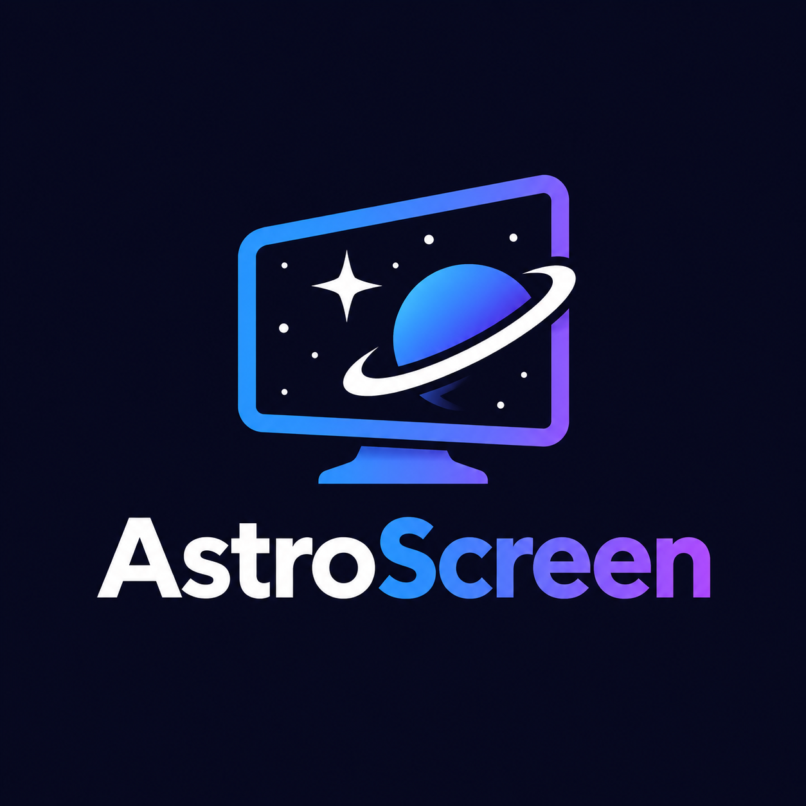

<div align="center">

  

  # AstroScreen

  **Graba tu pantalla y realiza capturas con una interfaz espacial intuitiva y elegante.**

  [](LICENSE)
  [](https://www.electronjs.org/)
  [](#)
  [](https://discord.gg/eBszxvAuhN)

  <br />

  [Características](#-características) • [Instalación](#-instalación-y-uso) • [Atajos](#-atajos-de-teclado) • [Permisos](#-permisos) • [Comunidad](#-soporte-y-comunidad)

</div>

---

## ✨ Características

- 🖥️ **Selector dinámico:** Elige cualquier pantalla o ventana activa con previsualización en tiempo real.
- 🎥 **Grabación de vídeo fluida:** Graba en formato WebM de alta definición con pausa y reanudación.
- 🎙️ **Audio versátil:** Soporte para micrófono y, en Windows, captura del audio del sistema (*loopback*).
- 📸 **Capturas instantáneas:** Exporta a PNG y copia directamente al portapapeles con un solo clic.
- 🎛️ **Ajustes personalizables:** Configura calidad (Ligera, Equilibrada, Máxima), tasa de cuadros (15, 30, 60 FPS) y temporizador de cuenta atrás (3s, 5s).
- 📂 **Biblioteca integrada:** Revisa, abre y gestiona tus grabaciones y capturas guardadas sin salir de la app.
- 🌌 **Diseño inmersivo:** Interfaz moderna inspirada en el espacio con fondo cósmico dinámico.

---

## 🚀 Instalación y uso

Para ejecutar AstroScreen en tu máquina local:

```bash
# 1. Clona el repositorio
git clone https://github.com/AstroSoftwareMoon/AstroScreen.git

# 2. Entra en el directorio
cd AstroScreen

# 3. Instala las dependencias
npm install

# 4. Inicia la aplicación
npm start
```

---

## ⌨️ Atajos de teclado

AstroScreen incluye atajos globales que puedes accionar incluso si la aplicación está minimizada:

| Atajo | Acción |
| :--- | :--- |
| <kbd>Ctrl</kbd> / <kbd>Cmd</kbd> + <kbd>Mayús</kbd> + <kbd>R</kbd> | Iniciar o detener grabación |
| <kbd>Ctrl</kbd> / <kbd>Cmd</kbd> + <kbd>Mayús</kbd> + <kbd>S</kbd> | Tomar captura de pantalla |

> Las capturas se guardan automáticamente en tu carpeta `Imágenes/AstroScreen` y las grabaciones en `Vídeos/AstroScreen`.

---

## 🔒 Permisos

- **Windows:** La primera vez puede saltar el aviso de SmartScreen al no estar firmado; haz clic en *Más información > Ejecutar de todas formas*.
- **macOS:** Concede permisos de *Grabación de pantalla* en *Ajustes del Sistema > Privacidad y seguridad*. Al abrir por primera vez, haz clic derecho sobre la app y selecciona *Abrir*.
- **Linux (Wayland):** El gestor de ventanas del sistema presentará su propio diálogo nativo de selección de fuentes.

---

## 💬 Soporte y comunidad

¿Tienes sugerencias, dudas o quieres charlar con el equipo de desarrollo?

Únete a nuestro servidor oficial de **Discord**:  
👉 [https://discord.gg/eBszxvAuhN](https://discord.gg/eBszxvAuhN)

Desarrollado con ❤️ por [AstroSoftware](https://github.com/AstroSoftwareMoon).

---

## 📜 Licencia

Distribuido bajo la Licencia [MIT](LICENSE).
